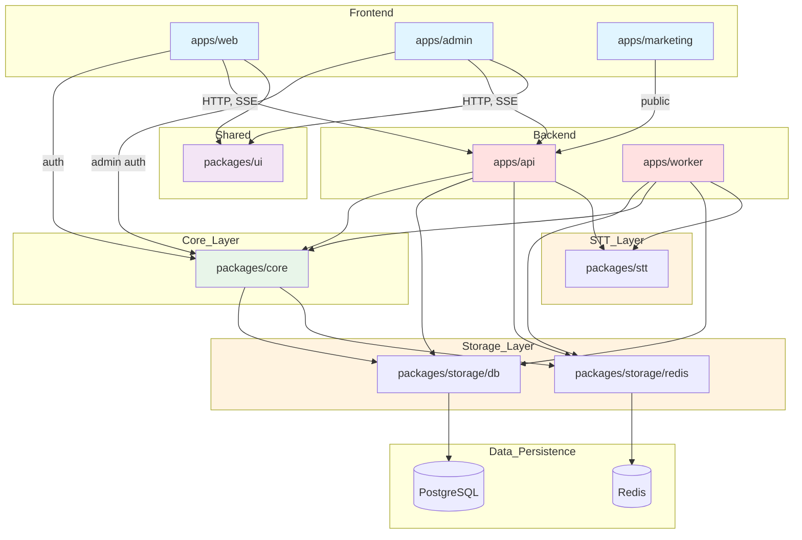

# PolyScript

> **Multi-language speech-to-text transcription service with team collaboration, billing, and full localization**

Transform audio into accurate transcripts in 5 languages with team-based access control, flexible billing plans, and comprehensive transcript management.

---

## ✨ Features

### 🎯 Core Transcription
- **Multi-language STT**: Support for 5 languages (English, German, Spanish, French, Japanese)
- **Whisper-powered**: Uses OpenAI's Whisper model for accurate speech-to-text transcription
- **Timestamp Support**: Precise segment-level timestamps (start/end times in milliseconds)
- **Speaker Diarization**: Optional speaker identification and labeling (best-effort)
- **Async Job Processing**: Upload audio and receive real-time progress updates via Server-Sent Events (SSE)
- **Multiple Input Sources**: Upload files directly or provide remote URLs
- **Progress Tracking**: Live updates with detailed stages (downloading, decoding, transcribing, translating, formatting, saving)
- **Automatic Retries**: Configurable retry policy with exponential backoff for failed jobs
- **Translation Engine**: TranslateGemma (55 languages) for post-transcription translation

### 👥 Team Collaboration
- **Multi-tenant Architecture**: Complete team isolation with role-based access control
- **Three Role Types**:
  - **ADMIN**: Full access, team management, billing control
  - **MEMBER**: Create jobs, view team transcripts, edit content
  - **VIEWER**: Read-only access to team resources
- **Email Invitations**: Invite team members with customizable roles
- **Team Settings**: Configure default language and team preferences

### 💳 Billing & Subscriptions
- **Three Flexible Plans**:
  - **FREE**: 5 uploads/month, 2 languages, 1 member, credit purchases available
  - **STANDARD**: 25 uploads/month, 5 languages, 5 members, $10/month
  - **PRO**: Unlimited uploads, 5 languages, unlimited members, priority support, $30/month
- **Stripe Integration**: Secure payment processing for subscriptions and credits
- **Credit System**: Purchase additional credits on FREE plan ($1 per upload)
- **Usage Tracking**: Monitor monthly usage and billing history
- **Invoice Management**: Download invoices and view payment history

### 📝 Transcript Management
- **Multiple Export Formats**: TXT, JSON, SRT (subtitles), VTT (WebVTT)
- **Edit History**: Track all changes with full audit trail
- **Segment Editing**: Edit individual transcript segments with timestamps
- **Revert Capability**: Restore original transcripts at any time
- **Translation Support**: Translate transcripts to target languages (plan-dependent)

### 🔧 Admin Capabilities
- **System Dashboard**: Overview of users, teams, jobs, and storage
- **User Management**: Suspend, unsuspend, delete, or impersonate users
- **Team Monitoring**: View team activity and manage team resources
- **Job Analytics**: Monitor job volume, error rates, and usage trends
- **Audit Logs**: Complete system activity tracking with detailed logs
- **Health Monitoring**: Real-time system health metrics (API, queue, worker)

### 🌍 Internationalization
- **Full Localization**: UI and API responses in 5 languages
- **Auto-detection**: Automatic language detection for transcripts
- **Localized Errors**: Error messages in user's preferred language
- **Multi-language Marketing**: Static marketing site in all supported languages

### 🔐 Authentication & Security
- **Email/Password Auth**: Secure authentication with email verification
- **Google OAuth**: Single sign-on with Google (PKCE-enabled for enhanced security)
- **JWT Tokens**: Access tokens with automatic refresh token rotation
- **Password Reset**: Secure password recovery via email
- **Admin Authentication**: Separate authentication system for admin panel
- **Multi-tenant Isolation**: Strict data isolation between teams

---

## 🏗️ Architecture

### System Overview



### Architecture Principles

- **Multi-tenancy**: All data is team-scoped with strict isolation at the query level
- **Separation of Concerns**: Business logic in `packages/core`, thin API routes
- **Async Processing**: Background job processing via Redis queue with dedicated worker
- **Event-Driven Updates**: Real-time progress via Server-Sent Events (SSE)
- **Soft Deletion**: Configurable grace period before hard deletion of resources

### Data Flow

1. **Upload** → User uploads audio via web app
2. **Validation** → API checks plan limits and creates job record
3. **Enqueue** → Job added to Redis queue
4. **Process** → Worker picks up job and processes with STT engine
5. **Progress** → Real-time updates sent via SSE
6. **Complete** → Results saved to database, user notified

---

## 🛠️ Technology Stack

### Frontend

| Technology | Purpose | Version |
|:-----------|:--------|:--------|
| **React** | UI framework | Latest |
| **Vite** | Build tool & dev server | Latest |
| **Astro** | Static site generation (marketing) | Latest |
| **TypeScript** | Type safety | Latest |
| **Tailwind CSS** | Styling | Latest |
| **React Router** | Client-side routing | Latest |
| **Zustand** | State management | Latest |
| **i18next** | Internationalization | Latest |
| **shadcn/ui** | Component library | Latest |

### Backend

| Technology | Purpose | Version |
|:-----------|:--------|:--------|
| **Python** | Runtime | 3.11+ |
| **FastAPI** | Web framework | Latest |
| **uvicorn** | ASGI server | Latest |
| **SQLAlchemy** | ORM | Latest |
| **Alembic** | Database migrations | Latest |
| **Pydantic** | Data validation | Latest |
| **Redis** | Queue & caching | Latest |

### Infrastructure

| Technology | Purpose |
|:-----------|:--------|
| **PostgreSQL** | Primary database |
| **Redis** | Job queue & caching |
| **Stripe** | Payment processing |
| **Railway** | Deployment platform |

### AI/ML Engines

| Engine | Purpose | Details |
|:-------|:--------|:--------|
| **Whisper** | Speech-to-text | OpenAI's Whisper model for accurate multi-language transcription |
| **TranslateGemma** | Translation | Google's Gemma-based translation model supporting 55 languages |

### Development Tools

| Tool | Purpose |
|:-----|:--------|
| **Bun** | TypeScript package manager |
| **uv** | Python package manager |
| **just** | Task runner |
| **Ruff** | Python linting & formatting |
| **Biome** | TypeScript linting & formatting |
| **Playwright** | E2E testing |
| **pytest** | Python testing |
| **Vitest** | TypeScript testing |

---

## 📁 Project Structure

```
poly-script/
├── apps/
│   ├── web/              # React web app (Vite)
│   │   ├── src/
│   │   │   ├── components/    # UI components
│   │   │   ├── pages/         # Route pages
│   │   │   ├── hooks/         # Custom React hooks
│   │   │   ├── stores/        # Zustand stores
│   │   │   └── lib/           # Utilities
│   │   └── package.json
│   │
│   ├── admin/            # Admin panel (Vite)
│   │   └── src/              # Similar structure to web
│   │
│   ├── marketing/        # Marketing site (Astro)
│   │   ├── src/
│   │   │   ├── pages/         # Static pages (5 languages)
│   │   │   ├── components/    # Astro components
│   │   │   └── layouts/       # Page layouts
│   │   └── astro.config.mjs
│   │
│   ├── api/              # FastAPI backend
│   │   ├── main.py           # App entry point
│   │   ├── routes/           # API endpoints
│   │   ├── middleware/       # Auth, CORS, logging
│   │   ├── dependencies/     # FastAPI dependencies
│   │   └── pyproject.toml
│   │
│   └── worker/           # Background worker
│       ├── main.py           # Worker entry point
│       ├── consumer.py       # Job consumer
│       └── pyproject.toml
│
├── packages/
│   ├── ui/               # Shared UI components (TypeScript)
│   │   ├── src/
│   │   │   ├── components/    # shadcn/ui components
│   │   │   └── lib/           # Utilities
│   │   └── package.json
│   │
│   ├── core/             # Business logic (Python)
│   │   ├── poly_core/
│   │   │   ├── services/      # Auth, billing, teams, jobs
│   │   │   ├── schemas/       # Pydantic models
│   │   │   └── utils/         # Helpers
│   │   └── pyproject.toml
│   │
│   ├── storage/
│   │   ├── db/           # Database layer (Python)
│   │   │   ├── poly_db/
│   │   │   │   ├── models/    # SQLAlchemy models
│   │   │   │   ├── repositories/ # Data access
│   │   │   │   └── migrations/   # Alembic migrations
│   │   │   └── pyproject.toml
│   │   │
│   │   └── redis/        # Redis layer (Python)
│   │       ├── poly_redis/
│   │       │   ├── client.py  # Redis client
│   │       │   └── queue.py   # Queue primitives
│   │       └── pyproject.toml
│   │
│   └── stt/              # STT engines (Python)
│       ├── poly_stt/
│       │   ├── engines/       # STT implementations
│       │   └── normalizer.py  # Output normalization
│       └── pyproject.toml
│
├── justfile              # Task runner recipes
├── pyproject.toml        # Python workspace config
├── package.json          # Bun workspace config
└── infra/                # Deployment and environment templates
    ├── .env.example      # Environment template
    └── railway-prod.json # Production service configuration
```

---

## 🚀 Getting Started

### Prerequisites

Install the following tools before setting up the project:

- **[Bun](https://bun.sh)** - Fast JavaScript runtime & package manager
- **[uv](https://github.com/astral-sh/uv)** - Fast Python package manager
- **[just](https://github.com/casey/just)** - Command runner (optional but recommended)
- **[PostgreSQL](https://www.postgresql.org/)** - Database (v14+)
- **[Redis](https://redis.io/)** - Queue & cache (v6+)

### Installation

1. **Clone the repository**
   ```bash
   git clone https://github.com/conceptcodes/poly-script.git
   cd poly-script
   ```

2. **Install dependencies**
   ```bash
   # Install all dependencies (TypeScript + Python)
   just install
   
   # Or manually:
   bun install              # TypeScript dependencies
   uv sync                  # Python dependencies (workspace)
   ```

3. **Configure environment**
   ```bash
   cp infra/.env.example .env
   # Edit .env with your configuration
   ```

   **Required environment variables:**
   - `DATABASE_URL` - PostgreSQL connection string
   - `REDIS_URL` - Redis connection string
   - `JWT_SECRET` - Secret for JWT signing
   - `ADMIN_JWT_SECRET` - Separate secret for admin tokens
   - `STRIPE_SECRET_KEY` - Stripe API key
   - `SMTP_HOST`, `SMTP_USER`, `SMTP_PASSWORD` - Email configuration
   - `GOOGLE_CLIENT_ID`, `GOOGLE_CLIENT_SECRET` - OAuth credentials

4. **Set up database**
   ```bash
   # Create PostgreSQL database
   createdb polyscript
   
   # Run migrations
   just db-migrate
   # Or: cd packages/storage/db && uv run alembic upgrade head
   ```

5. **Create admin user** (for admin panel access)
   ```bash
   cd apps/api
   uv run python scripts/create_admin.py \
     --email admin@example.com \
     --password YourSecurePassword \
     --full-name "Admin User"
   ```

6. **Start development servers**
   ```bash
   # Start all services (use separate terminals)
   just web        # Web app (http://localhost:5173)
   just admin      # Admin panel (http://localhost:5174)
   just marketing  # Marketing site (http://localhost:3000)
   just api        # API server (http://localhost:8000)
   ```

7. **Verify installation**
   - Visit http://localhost:8000/docs for API documentation
   - Visit http://localhost:5173 for the web app
   - Visit http://localhost:5174 for the admin panel

---

## 💻 Development

### Using the Task Runner

This project uses [`just`](https://github.com/casey/just) as the task runner. Run `just` to see all available commands.

**Common commands:**

```bash
# Development servers
just web              # Start web app
just admin            # Start admin panel
just marketing        # Start marketing site
just api              # Start API server
just frontend         # Start all frontend apps (parallel)

# Building
just build-ts         # Build all TypeScript apps
just build-web        # Build web app only
just build-admin      # Build admin panel only

# Testing
just test             # Run all tests
just test-ts          # TypeScript tests
just test-py          # Python tests
just test-e2e         # E2E tests (Playwright)

# Code quality
just lint             # Lint all code
just lint-fix         # Fix lint issues
just format           # Format all code
just format-check     # Check formatting
just typecheck        # TypeScript type checking

# Database
just db-migrate           # Run migrations
just db-migration "name"  # Create new migration

# CI/CD
just ci               # Run full CI checks
just pre-commit       # Pre-commit hook (lint, format, test)

# Utilities
just clean            # Clean build artifacts
```

## 🧪 Testing

### Test Philosophy

- **Unit tests**: Test individual functions and services
- **Integration tests**: Test API endpoints and database interactions
- **E2E tests**: Test complete user flows with Playwright

### Running Tests

```bash
# All tests
just test

# TypeScript tests (Vitest)
just test-ts
cd apps/web && bun run test:watch  # Watch mode

# Python tests (pytest)
just test-py
just test-pkg packages/core        # Test specific package
uv run pytest -k "test_auth"       # Run specific tests

# E2E tests (Playwright)
just test-e2e
cd apps/web && bun run test:e2e tests/auth.spec.ts  # Specific test
```

### Test Coverage

```bash
# Python coverage
uv run pytest --cov=poly_core --cov-report=html

# TypeScript coverage
cd apps/web && bun run test:coverage
```

---

## 📚 API Documentation

Once the API is running, access interactive documentation:

- **Swagger UI**: http://localhost:8000/docs
- **ReDoc**: http://localhost:8000/redoc

### API Versioning

All endpoints are versioned under `/v1/`:
- `/v1/auth/*` - Authentication
- `/v1/teams/*` - Team management
- `/v1/jobs/*` - Transcription jobs
- `/v1/transcripts/*` - Transcript management
- `/v1/billing/*` - Billing & subscriptions
- `/v1/admin/*` - Admin endpoints

### Authentication

The API uses JWT tokens for authentication:

1. **Login** → Receive access token + refresh token
2. **Include token** in requests: `Authorization: Bearer <token>`
3. **Refresh** when access token expires

---

## 🌐 Environment Variables

See `infra/.env.example` for a complete list. Key variables:

### Database & Cache
- `DATABASE_URL` - PostgreSQL connection string
- `REDIS_URL` - Redis connection string

### Authentication
- `JWT_SECRET` - Secret for user JWT tokens
- `JWT_EXPIRY` - Token expiry (default: 15m)
- `ADMIN_JWT_SECRET` - Separate secret for admin tokens
- `GOOGLE_CLIENT_ID` - Google OAuth client ID
- `GOOGLE_CLIENT_SECRET` - Google OAuth secret

### Payments
- `STRIPE_SECRET_KEY` - Stripe secret key
- `STRIPE_PUBLISHABLE_KEY` - Stripe publishable key
- `STRIPE_WEBHOOK_SECRET` - Webhook signing secret
- `STRIPE_PRICE_ID_STANDARD` - Standard plan price ID
- `STRIPE_PRICE_ID_PRO` - Pro plan price ID

### Email
- `SMTP_HOST` - Email server host
- `SMTP_PORT` - Email server port
- `SMTP_USER` - Email username
- `SMTP_PASSWORD` - Email password (use app password for Gmail)
- `SMTP_FROM` - From email address

### Application
- `APP_URL` - Web app base URL (for email links)
- `ADMIN_URL` - Admin panel base URL
- `CORS_ORIGINS` - Allowed CORS origins (comma-separated)
- `DEFAULT_LANGUAGE` - Default UI language (default: en)
- `MAX_UPLOAD_SIZE_MB` - Max audio file size (default: 100)

### Storage
- `STORAGE_BACKEND` - Storage backend: `local` or `s3`
- `STORAGE_PATH` - Local storage path (if local backend)
- `AWS_S3_BUCKET` - S3 bucket name (if s3 backend)
- `AWS_REGION` - AWS region
- `AWS_ACCESS_KEY_ID` - AWS access key
- `AWS_SECRET_ACCESS_KEY` - AWS secret key

---

## 🚢 Deployment

### Railway Deployment

This project is configured for deployment on [Railway](https://railway.app).

**Prerequisites:**
- Railway account
- PostgreSQL database (Railway addon)
- Redis database (Railway addon)

**Deployment steps:**

1. **Install Railway CLI**
   ```bash
   npm install -g @railway/cli
   railway login
   ```

2. **Link project**
   ```bash
   railway link
   ```

3. **Set environment variables**
   ```bash
   # Set all required variables from infra/.env.example
   railway variables set DATABASE_URL=<value>
   railway variables set REDIS_URL=<value>
   # ... set all other variables
   ```

4. **Deploy**
   ```bash
   railway up
   ```

5. **Run migrations**
   ```bash
   railway run just db-migrate
   ```

6. **Create admin user**
   ```bash
   railway run python apps/api/scripts/create_admin.py \
     --email admin@example.com \
     --password <secure-password>
   ```

### Production Configuration

The `infra/railway-prod.json` file contains the production service configuration.

**Production checklist:**
- [ ] Set all environment variables
- [ ] Configure PostgreSQL database
- [ ] Configure Redis instance
- [ ] Set up Stripe webhooks
- [ ] Configure email service (SMTP)
- [ ] Set up Google OAuth credentials
- [ ] Configure CORS origins
- [ ] Set secure JWT secrets
- [ ] Run database migrations
- [ ] Create admin user
- [ ] Test health endpoints
- [ ] Monitor logs and metrics

### Health Checks

- **API**: `GET /v1/health`
- **Admin**: `GET /v1/admin/system/health`

---

## 🤝 Contributing

We welcome contributions! Please follow these guidelines:

### Code Style

- **Python**: Follow PEP 8, use Ruff for linting/formatting (line length: 100)
- **TypeScript**: Use Biome for linting/formatting
- **Imports**: Use absolute imports with workspace aliases
- **Naming**: 
  - Python: `snake_case` for functions/variables, `PascalCase` for classes
  - TypeScript: `camelCase` for functions/variables, `PascalCase` for components

### Commit Conventions

Use [Conventional Commits](https://www.conventionalcommits.org/):

```
feat(web): add new feature
fix(sst): resolve bug
style(marketing): formatting changes
refactor(worker): code restructuring
test(admin): add tests
````

### Pull Request Process

1. Create a feature branch
2. Make changes following code style guidelines
3. Add tests for new functionality
4. Run `just pre-commit` to verify all checks pass
5. Submit PR with clear description

---


## 📄 License

MIT License - see LICENSE file for details

---

## 🙏 Acknowledgments

Built with:
- [FastAPI](https://fastapi.tiangolo.com/) - Modern Python web framework
- [React](https://react.dev/) - UI library
- [Vite](https://vitejs.dev/) - Build tool
- [Astro](https://astro.build/) - Static site generator
- [shadcn/ui](https://ui.shadcn.com/) - Component library
- [Stripe](https://stripe.com/) - Payment processing
- [Railway](https://railway.app/) - Deployment platform
